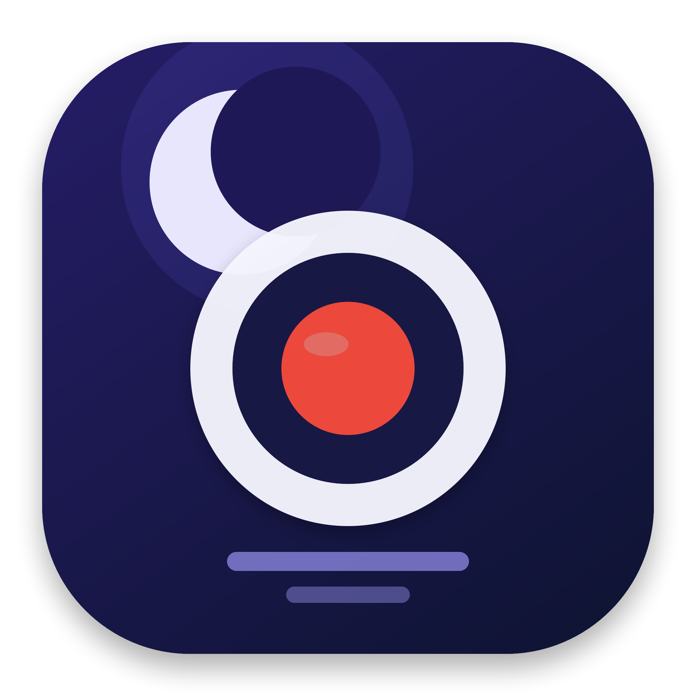

<div align="center">
  

  # 轻录屏 · ScreenFlowLite

  **简单、快速、原生的 macOS 录屏工具**

  基于 ScreenCaptureKit 与 AVFoundation 构建，专注于清晰录制、系统音频采集和轻量使用体验。

  <p>
    
    
    
    
  </p>
</div>

<p align="center">
  
</p>

## 为什么选择轻录屏

| | 特性 | 说明 |
| --- | --- | --- |
| 🎯 | 灵活录制 | 支持拖拽选择区域和全屏录制 |
| 🔊 | 完整收音 | 可分别控制系统音频与麦克风录制 |
| ✨ | 多档画质 | 标准、高清原生与 ProRes 超清三种模式 |
| ⌨️ | 全局快捷键 | 无需切换窗口即可快速开始录制 |
| ⏱️ | 倒计时 | 支持立即、3 秒或 5 秒后开始 |
| 📁 | 自动整理 | 自定义保存目录，录制完成后可在访达中定位 |

## 功能特性

- 使用 macOS 原生 ScreenCaptureKit 捕获屏幕
- 拖拽选择任意录制区域，或直接录制整个屏幕
- 录制系统音频，并可选混入麦克风声音
- H.264 MP4 输出，保留 Retina 显示器清晰度
- 提供标准、高清和 ProRes 超清画质选项
- 支持多组可配置的全局录制快捷键
- 显示鼠标指针与录制时长
- 录制完成后自动在访达中显示文件
- 内置诊断日志入口，便于定位权限和录制问题

## 系统要求

- macOS 13.0 Ventura 或更高版本
- 支持 Swift 5.10 的开发环境
- 首次使用需要授予“屏幕与系统音频录制”权限
- 使用麦克风时需要授予麦克风权限

## 快速开始

克隆仓库并运行构建脚本：

```bash
git clone git@github.com:baiyazi/recordVideo.git
cd recordVideo
chmod +x build-app.sh
./build-app.sh
open dist/轻录屏.app
```

构建完成后，应用位于：

```text
dist/轻录屏.app
```

## 权限设置

首次开始录制时，请前往：

> 系统设置 → 隐私与安全性 → 屏幕与系统音频录制

为“轻录屏”开启权限，然后重新启动应用。如果需要录制麦克风，请同时在“麦克风”权限中允许访问。

## 使用流程

1. 选择“划定区域”或“全屏”。
2. 设置倒计时、快捷键、录制画质和保存位置。
3. 按需开启系统音频或麦克风。
4. 点击录制按钮；区域模式下拖拽框选录制范围。
5. 完成录制后停止，视频会保存到所选目录。

## 技术栈

- **Swift / SwiftUI**：原生界面与应用逻辑
- **ScreenCaptureKit**：屏幕和系统音频捕获
- **AVFoundation**：音视频编码与 MP4 写入
- **Carbon Hot Keys**：全局快捷键支持
- **Core Image**：录制画面处理

## 项目结构

```text
ScreenFlowLite/
├── Sources/ScreenFlowLite/   # macOS 应用源码
├── Resources/                # Info.plist 与应用图标
├── docs/                     # 使用文档与 README 素材
├── Tools/                    # 图标和显示器辅助工具
├── Windows/                  # Windows 10/11 客户端
├── Package.swift             # Swift Package 配置
└── build-app.sh              # macOS 应用构建脚本
```

## 文档与 Windows 版本

- [完整使用说明](docs/使用说明.md)
- [Windows 10/11 客户端](Windows/ScreenFlowLite.Windows)
- [Windows 构建说明](Windows/README.md)

---

<p align="center">
  如果这个项目对你有帮助，欢迎 Star 支持。
</p>
